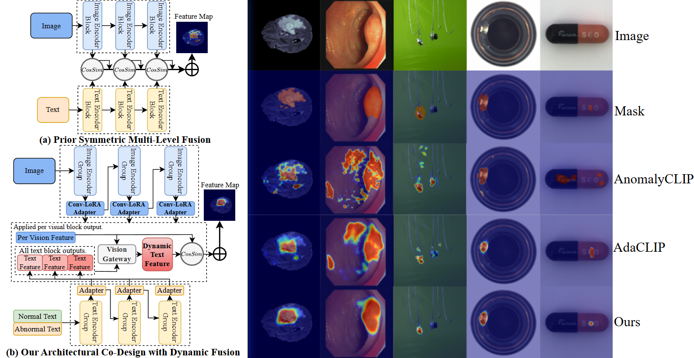
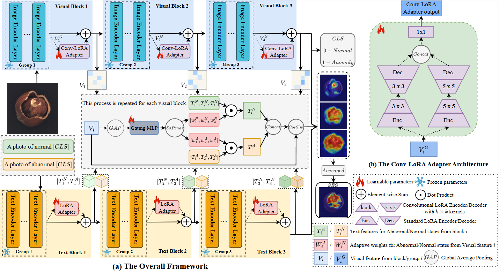

# ACD-CLIP: Decoupling Representation and Dynamic Fusion for Zero-Shot Anomaly Detection

**ACD-CLIP** is a novel Architectural Co-Design framework that refines feature representation and cross-modal fusion for
Zero-Shot Anomaly Detection (ZSAD). The official implementation of the
paper: [ACD-CLIP: Decoupling Representation and Dynamic Fusion for Zero-Shot Anomaly Detection](https://github.com/cockmake/ACD-CLIP).

## Introduction



Pre-trained Vision-Language Models (VLMs) like CLIP have shown promise in ZSAD but face challenges due to a lack of
local inductive biases and inflexible feature fusion mechanisms. ACD-CLIP addresses these limitations by jointly
refining feature representation and cross-modal fusion. Our framework introduces two key innovations:

1. **Convolutional Low-Rank Adaptation (Conv-LoRA) Adapter**: A parameter-efficient adapter that injects local inductive
   biases into the Vision Transformer (ViT) architecture, enabling fine-grained feature representation crucial for
   anomaly detection.

2. **Dynamic Fusion Gateway (DFG)**: A vision-guided mechanism that adaptively modulates text prompts based on visual
   context, enabling a flexible and powerful bidirectional fusion of visual and textual features.

Our synergistic co-design of representation and fusion achieves state-of-the-art results on diverse industrial and
medical benchmarks, demonstrating significant improvements in accuracy and robustness.

## Features



* **Architectural Co-Design Framework**: Jointly refines feature representation and cross-modal fusion for robust ZSAD.
* **Conv-LoRA Adapter**: A parameter-efficient adapter that injects local inductive biases for fine-grained feature
  representation.
* **Dynamic Fusion Gateway (DFG)**: A vision-guided mechanism for adaptive and flexible bidirectional fusion of visual
  and textual features.
* **State-of-the-Art Performance**: Achieves superior accuracy and robustness on a wide range of industrial and medical
  benchmarks.
* **Parameter-Efficient Fine-Tuning (PEFT)**: Leverages PEFT to enable architectural modifications while keeping the
  original VLM weights frozen.

## Getting Started

### Prerequisites

* Python 3.10+
* PyTorch 2.5.1+cu121
* torchvision 0.20.1+cu121
* Other dependencies listed in `requirements.txt`

### Installation

1. Clone the repository:
   ```bash
   git clone https://github.com/cockmake/ACD-CLIP.git
   cd ACD-CLIP
   ```

2. Install the required dependencies:
   ```bash
   pip install -r requirements.txt
   ```

3. Download the OpenCLIP ViT-L-14-336px model weights and place them in the `./model/` directory:
   ```bash
   wget https://openaipublic.azureedge.net/clip/models/3035c92b350959924f9f00213499208652fc7ea050643e8b385c2dac08641f02/ViT-L-14-336px.pt -P ./model/
   ```

## Usage

### Training

To train the ACD-CLIP model, run the following command:

```bash
python train.py --dataset <dataset_name> --save_path <path_to_save_checkpoints>
```

You can customize the training process by modifying the arguments in the `train.py` script. The available arguments
include:

* `--model_name`: The CLIP model to use (default: `ViT-L-14-336`)
* `--img_size`: The input image size (default: `518`)
* `--dataset`: The dataset to train on (e.g., `VisA`, `MVTec`)
* `--batch_size`: The batch size for training (default: `6`)
* `--epoch`: The number of training epochs (default: `20`)
* `--cuda_device`: The CUDA device ID to use (default: `0`)
* `--save_path`: The path to save checkpoints (default: `ckpt/test`)
* `--n_groups`: The number of groups for the adapter (default: `4`)
* `--image_adapt_weight`: The weight for the image adapter (default: `0.2`)
* `--conv_lora_rank`: The rank for Conv-LoRA adapters (default: `8`)
* `--conv_lora_alpha`: The alpha for Conv-LoRA adapters (default: `2.0`)
* `--conv_kernel_size_list`: The kernel sizes for Conv-LoRA adapters (default: `[3, 5]`)
* `--text_adapt_weight`: The weight for the text adapter (default: `0.2`)
* `--lora_rank`: The rank for LoRA adapters (default: `16`)
* `--lora_alpha`: The alpha for LoRA adapters (default: `2.0`)
* `--image_lr`: The learning rate for the image adapter (default: `0.001`)
* `--text_lr`: The learning rate for the text adapter (default: `0.0005`)
* `--lr_gamma`: The learning rate decay factor (default: `0.9`)

### Testing

To evaluate the trained model, run the following command:

```bash
python test.py --dataset <dataset_name> --save_path <path_to_checkpoints>
```

You can customize the testing process by modifying the arguments in the `test.py` script. The available arguments
include:

* `--model_name`: The CLIP model to use (default: `ViT-L-14-336`)
* `--img_size`: The input image size (default: `518`)
* `--n_groups`: The number of groups for the adapter (default: `4`)
* `--lora_rank`: The rank for LoRA adapters (default: `16`)
* `--lora_alpha`: The alpha for LoRA adapters (default: `2.0`)
* `--conv_lora_rank`: The rank for Conv-LoRA adapters (default: `8`)
* `--conv_lora_alpha`: The alpha for Conv-LoRA adapters (default: `2.0`)
* `--conv_kernel_size_list`: The kernel sizes for Conv-LoRA adapters (default: `[3, 5]`)
* `--dataset`: The dataset to test on (e.g., `MPDD`, `MVTec`)
* `--batch_size`: The batch size for testing (default: `84`)
* `--cuda_device`: The CUDA device ID to use (default: `0`)
* `--save_path`: The path to the saved checkpoints (default: `ckpt/issue`)

## Results

ACD-CLIP achieves state-of-the-art performance on a wide range of ZSAD benchmarks. Here's a summary of our results:

| Domain (Metric)              | Dataset    | WinCLIP      | CLIP-AD      | AnomalyCLIP  | AdaCLIP      | ours (N=2)       | ours (N=3)       | ours (N=4)       | ours (N=6)       |
|:-----------------------------|:-----------|:-------------|:-------------|:-------------|:-------------|:-----------------|:-----------------|:-----------------|:-----------------|
| **Industrial (Pixel-level)** | MVTec-AD   | (85.1, 18.0) | (89.8, 40.0) | (91.1, 34.5) | (86.8, 38.1) | **(91.7, 44.1)** | (91.4, 43.6)     | (90.9, 44.0)     | (90.0, 43.1)     |
|                              | BTAD       | (71.4, 11.2) | (93.1, 46.7) | (93.3, 42.0) | (87.7, 36.6) | (96.3, 51.2)     | (95.9, 51.2)     | **(96.5, 51.5)** | (94.6, 51.1)     |
|                              | MPDD       | (95.2, 28.1) | (95.1, 28.4) | (96.2, 28.9) | (96.6, 29.1) | **(97.0, 29.8)** | (96.3, 30.3)     | (96.1, 29.4)     | (96.6, 30.3)     |
|                              | RSDD       | (95.1, 2.1)  | (99.2, 31.9) | (99.1, 19.1) | (99.5, 38.2) | (99.1, 40.7)     | **(99.4, 41.3)** | (98.9, 40.4)     | (98.6, 40.1)     |
|                              | VisA       | (79.6, 5.0)  | (95.0, 26.3) | (95.4, 21.3) | (95.1, 29.2) | (95.7, 27.8)     | **(95.9, 29.6)** | (94.6, 27.5)     | (94.1, 27.3)     |
| **Medical (Pixel-level)**    | ColonDB    | (64.8, 14.3) | (80.3, 23.7) | (81.9, 31.3) | (79.3, 26.2) | (85.0, 35.9)     | **(85.1, 32.6)** | (83.3, 35.4)     | (80.7, 31.1)     |
|                              | ClinicDB   | (70.7, 19.4) | (85.8, 39.0) | (85.9, 42.2) | (84.3, 36.0) | (90.4, 53.5)     | (89.2, 54.0)     | **(89.8, 56.1)** | (85.0, 49.1)     |
|                              | Kvasir     | (69.8, 27.5) | (82.5, 46.2) | (81.8, 42.5) | (79.4, 43.8) | (88.5, 60.7)     | (88.8, 60.2)     | **(88.8, 61.3)** | (83.3, 54.8)     |
|                              | BrainMRI   | (86.0, 49.2) | (96.4, 54.2) | (95.6, 53.1) | (93.9, 52.3) | (96.6, 55.6)     | (95.3, 53.0)     | **(97.0, 61.0)** | (96.9, 56.1)     |
|                              | Liver CT   | (96.2, 7.2)  | (95.4, 7.1)  | (93.9, 5.7)  | (94.5, 5.9)  | **(97.3, 8.8)**  | (97.2, 7.5)      | (96.0, 6.8)      | (95.3, 6.2)      |
|                              | Retina OCT | (80.6, 39.8) | (90.9, 48.7) | (92.6, 55.3) | (88.5, 47.1) | **(96.1, 66.2)** | (93.7, 50.9)     | (91.3, 48.2)     | (91.5, 48.7)     |
| **Industrial (Image-level)** | MVTec-AD   | (89.3, 92.9) | (89.8, 95.3) | (90.3, 95.1) | (90.7, 95.2) | (90.9, 95.7)     | (90.7, 95.8)     | **(92.4, 96.8)** | (90.7, 95.7)     |
|                              | BTAD       | (83.3, 84.1) | (85.8, 85.2) | (89.1, 91.1) | (91.6, 92.4) | (93.5, 96.0)     | (94.9, 98.0)     | (93.3, 94.0)     | **(95.4, 98.2)** |
|                              | MPDD       | (63.6, 71.2) | (74.5, 77.9) | (73.7, 77.1) | (72.1, 76.9) | **(78.1, 83.7)** | (77.6, 82.3)     | (74.7, 79.0)     | (74.8, 78.2)     |
|                              | RSDD       | (85.3, 65.3) | (88.3, 73.9) | (73.5, 55.0) | (89.1, 70.8) | (94.0, 92.9)     | **(94.3, 92.7)** | (93.4, 92.2)     | (92.9, 91.9)     |
|                              | VisA       | (78.1, 77.5) | (79.8, 84.3) | (82.1, 85.4) | (83.0, 84.9) | **(85.6, 88.5)** | (85.5, 88.1)     | (83.0, 86.0)     | (84.1, 86.7)     |
| **Medical (Image-level)**    | BrainMRI   | (82.0, 90.7) | (82.8, 85.5) | (86.1, 92.3) | (84.9, 94.2) | (89.1, 97.2)     | (86.8, 96.9)     | **(88.1, 97.3)** | (87.3, 97.1)     |
|                              | Liver CT   | (64.2, 55.9) | (62.7, 51.6) | (61.6, 53.1) | (64.2, 56.7) | (60.2, 54.2)     | (65.8, 55.3)     | (64.4, 57.3)     | **(68.4, 58.9)** |
|                              | Retina OCT | (42.5, 50.9) | (67.9, 71.3) | (75.7, 77.4) | (82.7, 80.3) | **(84.4, 85.6)** | (81.1, 80.9)     | (80.3, 79.1)     | (82.0, 79.7)     |
